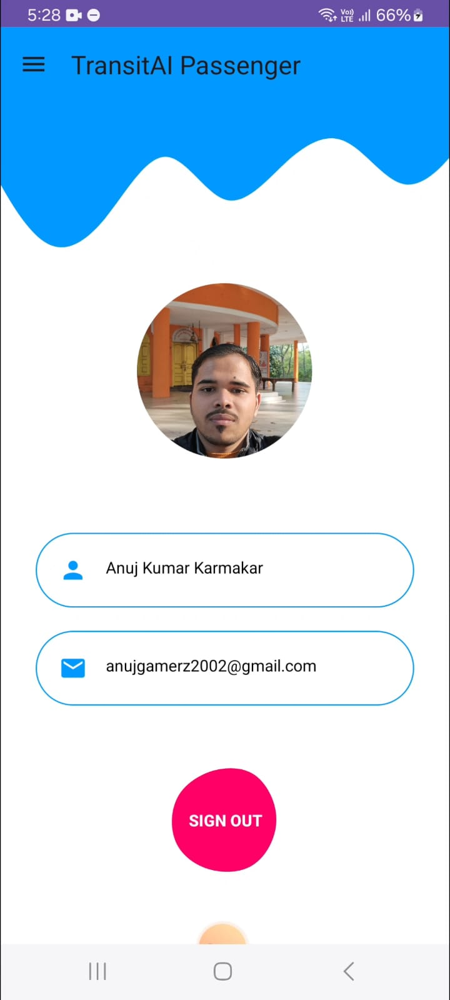
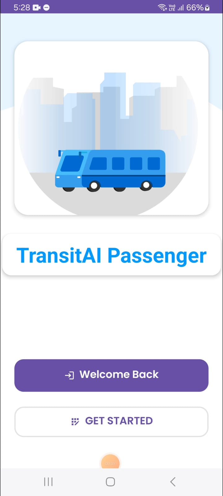

# TransitAI Passenger 🚌

<div align="center">


[](LICENSE)
[](CONTRIBUTING.md)
</div>

## Overview 🎯
TransitAI Passenger is a modern Android application developed for Delhi Transport Corporation (DTC) that revolutionizes the bus ticketing experience. Built with a focus on user experience and environmental consciousness, it offers digital ticket management while tracking the environmental impact of choosing public transport.

## Key Features 🌟
- **Secure Authentication**
  - Firebase-powered user authentication
  - Profile management with real-time updates

- **Digital Ticketing**
  - Hassle-free ticket booking
  - Real-time ticket status tracking
  - Easy booking cancellation
  - Comprehensive booking history

- **Environmental Impact**
  - CO2 emission savings calculator
  - Environmental impact visualization
  - Promotion of sustainable transport

## Architecture 🏗️
The application follows MVVM (Model-View-ViewModel) architecture pattern ensuring:
- Clear separation of concerns
- Better testability
- Easy maintenance
- Scalability

## Tech Stack 💻
- **Frontend**: Java, XML
- **Backend**: Firebase
  - Authentication
  - Firestore
  - Realtime Database
  - Cloud Storage
- **Architecture Pattern**: MVVM
- **Tools & Libraries**:
  - Android Studio
  - Firebase SDK
  - Material Design Components
  - [Add other major libraries used]

## Screenshots 📱
<div align="center">




</div>

## Getting Started 🚀

### Prerequisites
- Android Studio Arctic Fox or later
- JDK 15 or higher
- Android SDK API 21 or higher
- Firebase account

### Installation Steps
1. Download and extract the ZIP file
   ```bash
   # Windows
   Right-click the ZIP file and select "Extract All"
   
   # macOS
   Double-click the ZIP file
   
   # Linux
   unzip TransitAI_Passenger.zip
   ```

2. Open in Android Studio
   - Launch Android Studio
   - Select "Open an Existing Project"
   - Navigate to the extracted folder
   - Click OK

3. Firebase Setup
   - Add your `google-services.json` file to the app directory
   - Enable required Firebase services:
     - Authentication
     - Firestore
     - Realtime Database
     - Storage

4. Build and Run
   - Sync project with Gradle files
   - Run on emulator or physical device

## Contributing 🤝
We welcome contributions! Please see our [Contributing Guidelines](CONTRIBUTING.md) for details.

## Project Status 📊
- Current Version: 1.0.0
- Development Status: Active

## Demo 🎥
Check out our [YouTube Demo](https://youtu.be/HTf8Q3TGhcc) to see the app in action!

## Contact 📧
- **Developer**: Anuj Kumar Karmakar
- **Email**: anujkarmakar999@gmail.com
- **LinkedIn**: [anujkkarmakar](https://www.linkedin.com/in/anujkkarmakar/)
- **GitHub**: [anujkkarmakar](https://github.com/anujkkarmakar)

## License 📄
This project is licensed under the MIT License - see the [LICENSE](LICENSE) file for details.

## Acknowledgments 🙏
- Delhi Transport Corporation (DTC)
- Smart India Hackathon 2024
- [Other acknowledgments]

---
<div align="center">
Built with ❤️ for Smart India Hackathon 2024
</div>
